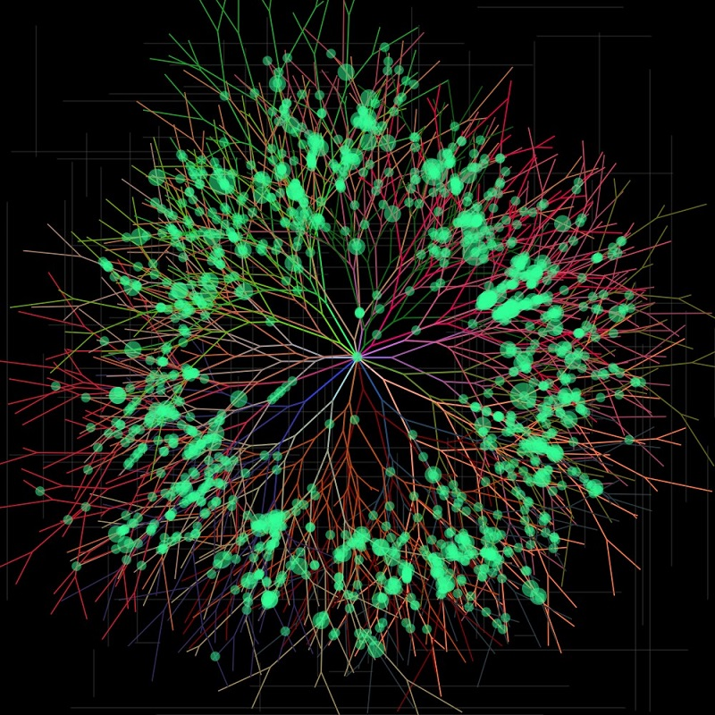

# Algorithmic City

#### David Berthiaume
#### dberthiaume@g.harvard.edu

---
This is an algorithmic art project that generates 3D procedural cities 
using the primary branching technique that was used in population 
centers, expanding that idea to 3D.
---

### Inspiration list

---

